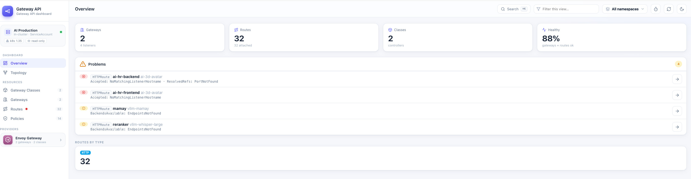
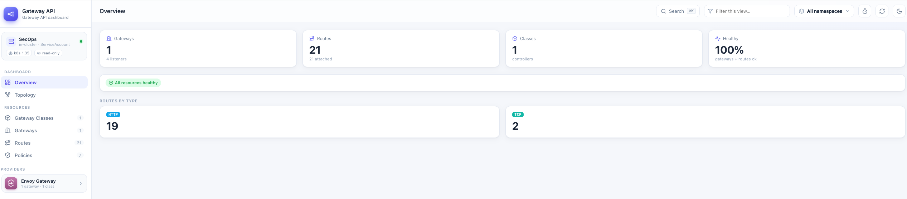

# Gateway API UI

A dashboard for the Kubernetes **Gateway API** (`gateway.networking.k8s.io`) — a spiritual
successor to the old Traefik dashboard for Envoy-based gateways (Cilium, Envoy Gateway, NGINX,
Istio, …), including the Envoy AI Gateway. Read-only by default, with optional write mode.

It visualizes the whole object graph at a glance:

```
GatewayClass ──▶ Gateway (+ Listeners) ──▶ HTTP/GRPC/TLS/TCP Route ──▶ Backend (Service)
```

See [ROADMAP.md](ROADMAP.md) for the design rationale and milestones.

## Screenshots

Overview surfaces broken routes with the exact condition reason behind them — the fastest answer
to "why is my route 404/503?":



…and stays quiet when everything is healthy, with a per-type route breakdown, in-cluster context,
detected providers, and a ⌘K command palette:



## Features

- 📊 **Overview** — object counts, health summary, and a "problems" list that surfaces the
  exact `Accepted` / `Programmed` / `ResolvedRefs` condition reason behind a broken route.
- 🚪 **Gateways** — listeners (host / port / protocol / TLS), addresses, attached-route counts,
  per-listener status.
- 🧭 **Routes** (HTTP / GRPC / TLS / TCP) — hostnames, path/method/header matches, filters,
  weighted backendRefs, resolved-refs status.
- 🌐 **Topology** — GatewayClass → Gateway → Route → Backend flow graph with hover highlighting,
  live endpoint counts (catches "route OK but 0 endpoints"), click-through to details.
- 📄 **Detail drawer** — three tabs per object: **Summary** (status conditions), **Related**
  (clickable neighbours — parents, routes, backends, policies — each with its own health, so you
  can hop across the graph), and raw **YAML**.
- 🛡️ **Policies** — Envoy Gateway `SecurityPolicy` / `ClientTrafficPolicy` / `BackendTrafficPolicy`
  and AI Gateway `BackendSecurityPolicy`, grouped by kind with resolved `targetRef`s and status.
- ✨ **AI Gateway** — Envoy `AIGatewayRoute` view.
- 🔌 Optional CRDs (policies, AI gateway, TLS/TCP routes) auto-hide when not installed.
- ⌘K **Command palette** — fuzzy-jump to any gateway / route / policy across all namespaces,
  fully keyboard-driven (↑/↓ to move, ↵ to open, esc to close).
- ⌨️ **Keyboard & a11y first** — visible focus rings, focus-trapped dialog (esc to close, focus
  restored on close), `aria-current` / `aria-live` / `role` semantics, skip-to-content link,
  status conveyed by icon+text (not colour alone), and `prefers-reduced-motion` respected.
- 📋 **Copy YAML / copy `kubectl` command** straight from the detail drawer.
- 🌗 Light/dark theme, namespace selector, per-view filter, configurable auto-refresh, with
  stale-while-revalidate updates (content never blanks on refresh) and a top progress bar.
- 📈 **Route traffic metrics** (optional) — RPS / p95 latency / error-rate + sparkline per route,
  pulled from **Prometheus**.
- ✏️ **Write mode** (optional, off by default) — create / edit / delete Gateway API objects from a
  YAML editor for quick debugging, gated by RBAC + auth.
- 🔐 **Read-only by default** (`get`/`list`/`watch`), non-root container, minimal RBAC, optional
  `NetworkPolicy` to keep direct pod access restricted to the gateway.

### Keyboard shortcuts

| Key            | Action                              |
|----------------|-------------------------------------|
| `⌘K` / `Ctrl+K`| Open the command palette            |
| `↑` / `↓`      | Move selection in the palette       |
| `↵`            | Open the selected / focused resource|
| `Esc`          | Close palette or detail drawer      |
| `Tab`          | Cycle focus (trapped inside dialogs)|

## How it runs (two modes, one binary)

The backend auto-detects how to talk to the apiserver:

| Mode        | When                                          | Credentials                              |
|-------------|-----------------------------------------------|------------------------------------------|
| **Local**   | run on your laptop                            | `~/.kube/config` current context         |
| **In-cluster** | `KUBERNETES_SERVICE_HOST` is set (a pod)  | the pod's **ServiceAccount** + RBAC       |

```
            kubeconfig (local)  ──┐
                                  ├──▶  gateway-api-ui (FastAPI)  ──▶  browser SPA
   ServiceAccount (in-cluster) ──┘        read-only /api/*
```

## Run locally (kubeconfig)

```bash
make install          # pip install -r code/requirements.txt
make dev              # uvicorn with autoreload on :8000
# open http://localhost:8000
```

Pick a specific context / namespace scope via env vars:

```bash
KUBE_CONTEXT=my-cluster make dev
```

Or with Docker against your local kubeconfig:

```bash
make docker
docker run --rm -p 8000:8000 -v "$HOME/.kube:/home/appuser/.kube:ro" \
  -e KUBECONFIG=/home/appuser/.kube/config gateway-api-ui:dev
```

## Run in-cluster

### Helm (recommended)

From the published Helm repo (GitHub Pages):

```bash
helm repo add gateway-api-ui https://wacken89.github.io/gateway-api-ui
helm repo update
helm install gateway-api-ui gateway-api-ui/gateway-api-ui \
  --namespace gateway-api-ui --create-namespace
kubectl -n gateway-api-ui port-forward svc/gateway-api-ui 8000:80
# open http://localhost:8000
```

…or straight from this checkout: `helm install gateway-api-ui ./charts/gateway-api-ui -n gateway-api-ui --create-namespace`.

The chart ships a ClusterRole (read-only by default, write verbs via `write.enabled`) + binding, a
non-root Deployment, a Service, and optional `ingress` / `httpRoute` (Gateway API) /
`ServiceMonitor` / `HPA` / `NetworkPolicy` (restrict direct pod access to the gateway + Prometheus).
See [charts/gateway-api-ui/values.yaml](charts/gateway-api-ui/values.yaml).

### Plain manifests

```bash
make deploy           # kubectl apply -f deploy/
kubectl -n gateway-api-ui port-forward svc/gateway-api-ui 8000:80
```

`deploy/` contains `rbac.yaml` (ServiceAccount + read-only ClusterRole), `deployment.yaml`
(Namespace + non-root Deployment + Service) and an optional `httproute.yaml`. Put SSO in front
before exposing it beyond the cluster.

> **Releases** (GitHub Actions): pushing a `vX.Y.Z` tag builds and pushes the multi-arch image
> `wacken/gateway-api-ui` to **Docker Hub**; pushing to `main` runs **chart-releaser**, which
> packages the chart and publishes it to the **Helm repo** on the `gh-pages` branch.

## Configuration (env vars)

| Variable             | Default       | Purpose                                            |
|----------------------|---------------|----------------------------------------------------|
| `KUBE_CONTEXT`       | current       | kubeconfig context to use (local mode only)        |
| `KUBECONFIG`         | `~/.kube/config` | path to kubeconfig (local mode only)            |
| `CACHE_TTL_SECONDS`  | `5`           | server-side cache TTL to spare the apiserver        |
| `CLUSTER_NAME`       | `in-cluster`  | label shown in the UI when running in-cluster       |
| `LOG_LEVEL`          | `INFO`        | log verbosity                                       |
| `AUTH_ENABLED`       | `false`       | turn the group authorization on/off                 |
| `AUTH_ALLOWED_GROUPS`| —             | comma-separated Keycloak groups allowed in (empty = any authenticated) |
| `AUTH_LOGOUT_PATH`   | `/logout`     | path Envoy intercepts to end the OIDC session       |
| `AUTH_*_HEADER`      | `X-Auth-Request-*` | headers the gateway forwards identity in (`NAME`/`USERNAME`/`EMAIL`/`GROUPS`) |
| `WRITE_ENABLED`      | `false`       | enable create/edit/delete from the UI (needs write RBAC) |
| `PROMETHEUS_URL`     | —             | Prometheus base URL; enables per-route traffic metrics |
| `PROMETHEUS_QUERY_*` | Envoy GW defaults | override the `RPS` / `P95` / `ERROR_RATE` PromQL (`{range}` = window) |
| `PROMETHEUS_CLUSTER_REGEX` | `^httproute/(?P<ns>…)/(?P<name>…)` | maps the metric label back to a route |

## Write mode (optional)

The dashboard is **read-only by default**. Set `WRITE_ENABLED=true` (and grant the write verbs in
RBAC — `helm … --set write.enabled=true` does both) to turn on create / edit / delete:

- a **New** button (top bar) opens a YAML/form editor prefilled with an HTTPRoute template;
- **Edit** / **Delete** appear in the detail drawer;
- **Apply** sends the manifest to `POST /api/apply` (multi-doc YAML supported), which create-or-replaces
  each object. Great for **quick debugging** — tweak a route and apply without leaving the UI.

Writes go through the same auth gate as reads, are CSRF-protected (same-origin check), and put it
behind SSO + a restricted group.

## Route traffic metrics (optional, Prometheus)

Set `PROMETHEUS_URL` to enrich route cards with live **RPS / p95 latency / error-rate + a sparkline**,
and open a route's drawer for a **Metrics** tab with full time-series charts. Queries are templated
and default to Envoy Gateway's per-cluster Envoy stats; override
`PROMETHEUS_QUERY_RPS|P95|ERROR_RATE` and `PROMETHEUS_CLUSTER_REGEX` to fit your metrics pipeline.
A few grouped queries cover every route (not one-per-route), scoped to just the routes currently on
screen; if Prometheus is unreachable the block just hides.

## Authentication & authorization

Authentication is **not** done by this app — it's done at the edge by **Envoy Gateway + Keycloak**
(an OIDC `SecurityPolicy`, managed via your `gateway-api-resources`, *not* this chart). By the time
a request reaches the app the user is already authenticated, and Envoy forwards the identity as
request headers (map JWT claims → headers in the SecurityPolicy).

This app then does **authorization only**: with `auth.enabled=true` it checks the user's groups
against `auth.allowedGroups`. Users outside those groups get a full-screen *Access denied* screen
(with their identity + a logout button) and every `/api/*` data call returns `403`. The signed-in
user's name and a **Log out** button appear in the sidebar. `/metrics` and `/healthz` stay open
(for Prometheus and probes). With `auth.enabled=false` the app is fully open (local use).

Example Envoy `SecurityPolicy` to put in your `gateway-api-resources` (OIDC + claim→header mapping):

```yaml
apiVersion: gateway.envoyproxy.io/v1alpha1
kind: SecurityPolicy
metadata:
  name: gateway-api-ui-oidc
spec:
  targetRefs:
    - group: gateway.networking.k8s.io
      kind: HTTPRoute
      name: gateway-api-ui            # the route from gateway-api-resources
  oidc:
    provider:
      issuer: https://keycloak.example.com/realms/my-realm
    clientID: gateway-api-ui
    clientSecret: { name: gateway-api-ui-oidc }   # Secret with client-secret
    scopes: ["openid", "profile", "email", "groups"]
    logoutPath: /logout
  # map ID-token claims to the headers the app reads
  jwt:
    providers:
      - name: keycloak
        issuer: https://keycloak.example.com/realms/my-realm
        remoteJWKS: { uri: https://keycloak.example.com/realms/my-realm/protocol/openid-connect/certs }
        claimToHeaders:
          - { claim: name,               header: X-Auth-Request-User }
          - { claim: preferred_username, header: X-Auth-Request-Preferred-Username }
          - { claim: email,              header: X-Auth-Request-Email }
          - { claim: groups,             header: X-Auth-Request-Groups }
```

Then in the chart: `auth.enabled=true`, `auth.allowedGroups={gateway-admins}`.

## API

Read endpoints are always available; the write endpoints only when `WRITE_ENABLED=true`.

| Endpoint                                   | Returns                                  |
|--------------------------------------------|------------------------------------------|
| `GET /api/me`                              | current user identity + allowed/logout   |
| `GET /api/context`                         | connection mode, context, k8s version    |
| `GET /api/namespaces`                      | namespaces (falls back to object-derived)|
| `GET /api/overview?namespace=`             | counts, health tally, problems           |
| `GET /api/gatewayclasses`                  | GatewayClasses                           |
| `GET /api/gateways?namespace=`             | Gateways + listeners + status            |
| `GET /api/routes?namespace=&type=`         | HTTP/GRPC/TLS/TCP routes                  |
| `GET /api/graph?namespace=`                | topology `{nodes, edges}`                |
| `GET /api/policies?namespace=`             | Envoy/AI policies + per-kind availability |
| `GET /api/object?kind=&name=&namespace=`   | raw object + YAML                        |
| `GET /api/related?kind=&name=&namespace=`  | clickable related resources + their health |
| `GET /api/ai/routes?namespace=`            | Envoy AIGatewayRoutes (if CRD present)   |
| `GET /api/metrics/routes?namespace=`       | per-route RPS / p95 / error-rate + sparkline (Prometheus) |
| `POST /api/apply`                          | create/replace from YAML manifest — **write mode** |
| `DELETE /api/object?kind=&name=&namespace=`| delete an object — **write mode**        |
| `GET /metrics`                             | Prometheus metrics (see below)           |
| `GET /healthz`                             | liveness/readiness                       |

## Metrics (Prometheus)

`/metrics` exposes both the UI's own HTTP metrics and **live Gateway API state**, so you can
alert on "a route went unhealthy" in Prometheus instead of only seeing it in the UI. Domain
gauges are read from the cached kube client at scrape time (no extra apiserver load).

| Metric                                   | Labels          | Meaning                                |
|------------------------------------------|-----------------|----------------------------------------|
| `gatewayapi_scrape_ok`                   | —               | 1 if the apiserver was reachable        |
| `gatewayapi_gateways`                    | `health`        | Gateways by health (ok/warn/error/unknown) |
| `gatewayapi_routes`                      | `type`,`health` | Routes by type & health                 |
| `gatewayapi_gatewayclasses`              | `health`        | GatewayClasses by health                |
| `gatewayapi_policies`                    | `kind`,`health` | Envoy/AI policies by kind & health      |
| `gatewayapi_listeners_total`             | —               | Total Gateway listeners                 |
| `gatewayapi_attached_routes_total`       | —               | Routes attached across all listeners    |
| `gatewayapi_ui_http_requests_total`      | `method`,`path`,`status` | UI backend request count       |
| `gatewayapi_ui_http_request_duration_seconds` | `method`,`path` | UI backend request latency         |

Example alert: `sum(gatewayapi_routes{health="error"}) > 0`.

With the Prometheus Operator, enable the bundled ServiceMonitor:
`--set metrics.serviceMonitor.enabled=true --set metrics.serviceMonitor.labels.release=<your-prometheus-release>`.

## Stack

Python **FastAPI** + official `kubernetes` client; static SPA (**Alpine.js + Lucide**, vendored)
with handcrafted, build-free CSS. No Node/Tailwind build step.

## Tech notes

- Tolerates missing CRDs: a cluster without `TLSRoute`/`TCPRoute` or the Envoy AI Gateway just
  shows empty sections instead of erroring.
- Tries Gateway API versions newest-first (`v1` → `v1beta1` / `v1alpha2`) and remembers what the
  apiserver serves.
- If the ServiceAccount can't list namespaces cluster-wide, the namespace list is derived from the
  objects it *can* see.
- **Scales to 1000+ routes**: the Routes view is server-paginated (slim payloads, infinite scroll)
  with server-side search; full per-rule detail loads lazily in the drawer. Prometheus metrics are
  fetched only for the routes currently on screen (`/api/metrics/routes?keys=…` scopes the PromQL),
  so neither the browser nor Prometheus is hit with everything at once.

## Contributing

Issues and PRs are welcome. The frontend is build-free (vanilla Alpine.js + handcrafted CSS, no
Node/Tailwind step), so a typical change is just editing `code/` and running `make dev`.

CI on every PR runs: a Python/JS syntax check and `helm lint`/`template`, plus a **security
pipeline** — [gitleaks](https://github.com/gitleaks/gitleaks) secret-leak scanning (full git
history, weekly schedule too) and a [Trivy](https://github.com/aquasecurity/trivy) dependency/IaC
scan. See [.github/workflows/security.yml](.github/workflows/security.yml).

## License

[Apache License 2.0](LICENSE).
